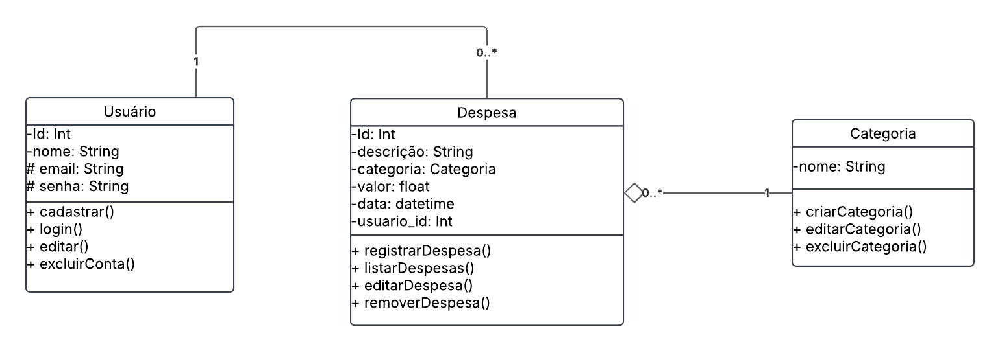
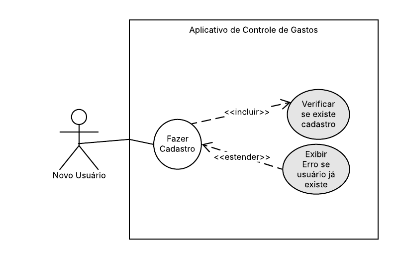
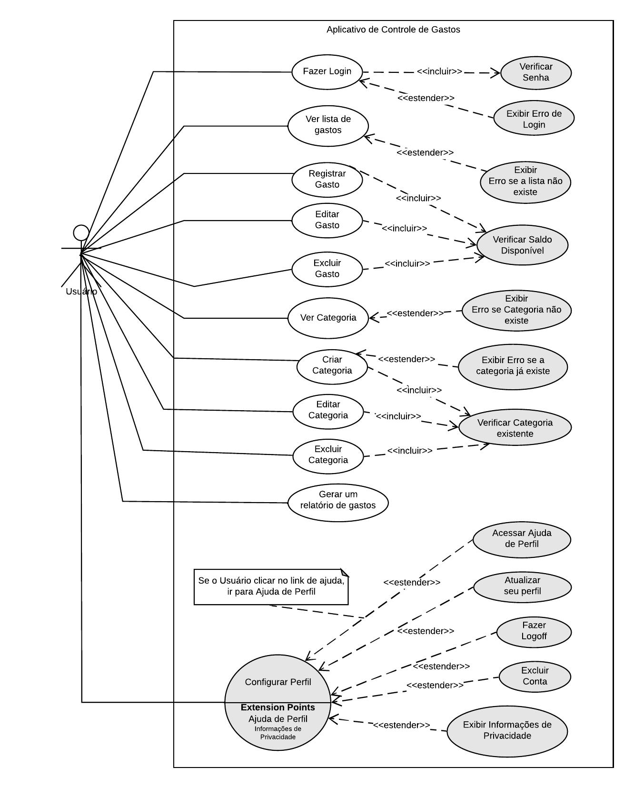
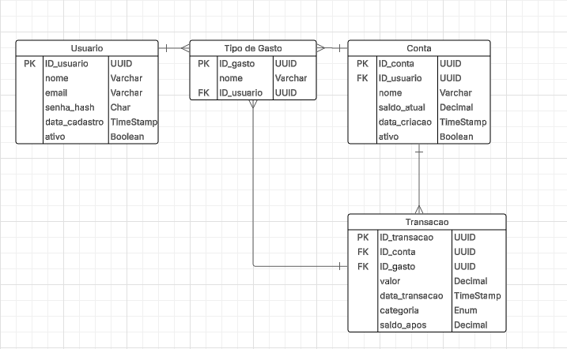

# api-despesas-python-03

# 1. Introdução:

## Descrição geral do projeto

Este projeto de gerenciamento de gastos tem como objetivo ser uma ferramenta personalizada para controle financeiro pessoal. O usuário pode registrar receitas e despesas, e categorizá-las a fim de acompanhar o fluxo de caixa.

## Funcionalidades do sistema:

- **Registro de transações**: inserção de dados como data, valor, descrição e categoria.
- **Categorização**: classificação de despesas em categorias como alimentação, transporte, lazer, etc.

## Tecnologias utilizadas:

- **Python**
- **PostgreSQL**

## Objetivo da API:

- Controle de gastos pessoais.

# 2. Arquitetura do Sistema:

Diagrama de Classes:

Diagrama de Caso de Uso:

# 3. Estrutura de Banco de Dados:

Diagrama de Relacionamento de Entidades:

